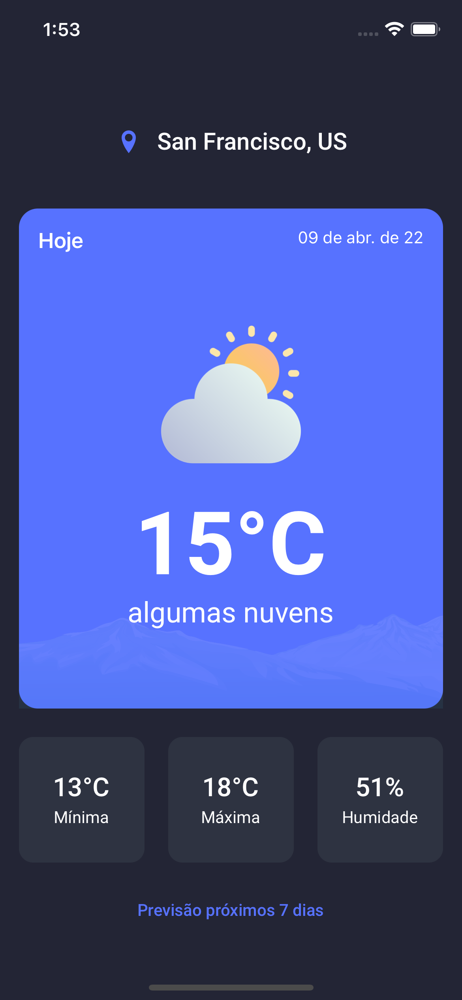
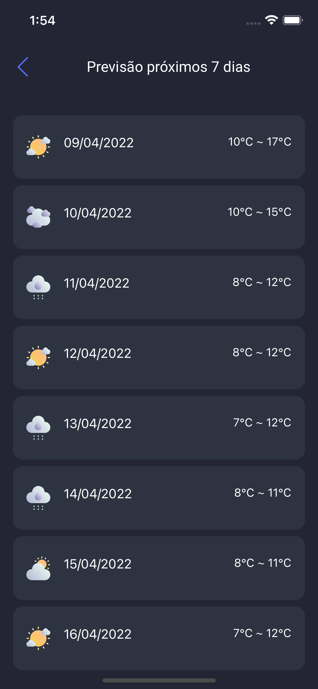

<h1 align="center">
    Weather App
</h1>

  

  <a href="#rocket-tecnologias">Tecnologias</a>&nbsp;&nbsp;&nbsp;|&nbsp;&nbsp;&nbsp;
  <a href="#-projeto">Projeto</a>&nbsp;&nbsp;&nbsp;|&nbsp;&nbsp;&nbsp;
  <a href="#memo-licença">Licença</a>

 

  
  

## :rocket: Instalação

Link Expo: https://expo.dev/@danielsousast/WeatherApp

  

## :rocket: Tecnologias

Esse projeto foi desenvolvido com as seguintes tecnologias:

- Expo
- Typescript
- Redux
- Redux Saga
- Context API
- Hooks
- Jest e Testing Library
- Styled Components
- Moti Skelecton
- React Navigation
- Expo Fonts

## 💻 Projeto

O Weather é um aplicativo que apresenta o clima atual.

## :memo: Licença

Esse projeto está sob a licença [MIT](https://choosealicense.com/licenses/mit/)

---

Feito por Daniel Sousa :wave: [LikedIn](https://www.linkedin.com/in/danielsousast/)
